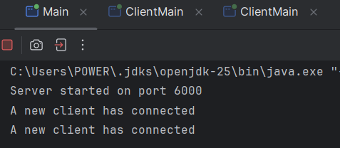
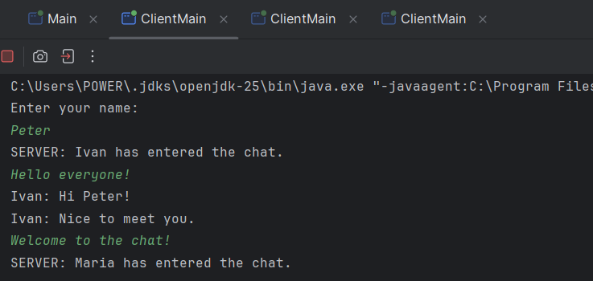
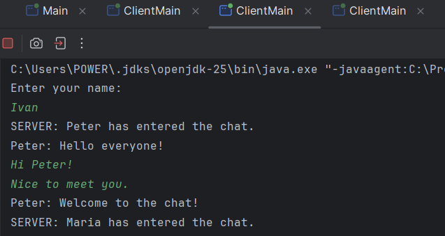
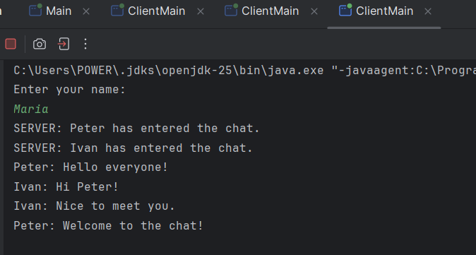

# Java Multithreaded Chat Server

A multi-threaded Java TCP chat application that allows multiple clients to connect to a server, exchange messages in real time and receive chat history upon joining.

## Project Overview

This project demonstrates the implementation of a multi-threaded client-server architecture using Java TCP sockets.

Each connected client is handled in a separate thread, allowing multiple users to communicate simultaneously. Messages are broadcast to all connected clients, while newly connected users automatically receive the previous chat history.

## Features

- Multi-threaded TCP server
- Multiple client support
- Real-time message broadcasting
- Chat history synchronization
- Username-based messaging
- Automatic client connection handling

## Technologies

- Java
- TCP Sockets
- Multithreading
- Object-Oriented Programming (OOP)
- IntelliJ IDEA

## Skills Demonstrated

- Network Programming
- Concurrent Programming
- Java Threads
- TCP Client-Server Architecture
- Socket Communication
- Object-Oriented Design

## Architecture

```text
                +----------------+
                |     Server     |
                +----------------+
                        |
        +---------------+---------------+
        |                               |
+---------------+               +---------------+
| ClientHandler |               | ClientHandler |
|   (Thread)    |               |   (Thread)    |
+---------------+               +---------------+
        |                               |
   +---------+                     +---------+
   | Client  |                     | Client  |
   +---------+                     +---------+
```

## How it Works

```text
Client 1
      │
Client 2
      │
      ▼
 TCP Socket
      │
      ▼
Server
      │
      ▼
ClientHandler (Thread)
      │
      ▼
Broadcast Message
```

## Installation

Clone the repository:

```bash
git clone https://github.com/petzmitev/java-multithreaded-chat-server.git
```

Open the project in IntelliJ IDEA.

Run the server:

```text
Run -> Server/Main.java
```

Run the client:

```text
Run -> Client/ClientMain.java
```

Start multiple client instances to communicate with each other.

## Demo

### Server

The server starts on port **6000** and creates a dedicated thread for every connected client.



### Client 1

The first client joins the chat and exchanges messages with other connected clients.



### Client 2

The second client joins the chat and communicates in real time with the first client.



### Client 3 - Chat History

The third client joins after the conversation has already started and automatically receives the previous chat history from the server.



## Future Improvements

- Private messaging
- User authentication
- Graphical User Interface (GUI)
- Message persistence using a database
- End-to-end encryption

## Author

Peter Mitev
